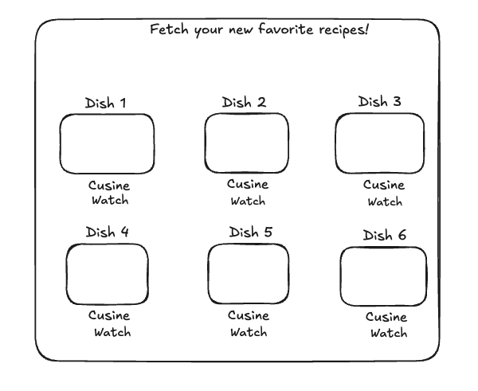
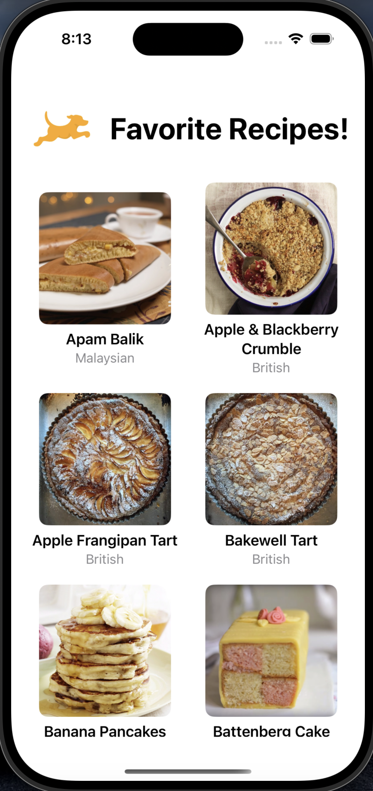

# Fetch Mobile Take Home Project ReadMe

## Steps to Run the App

1. **Build and Run Your App**:
   - Select **Fetch Recipes** from the project navigator.
   - Click the **Run** button in the toolbar or use the shortcut (⌘R).
   
2. **Choose the App Target**:
   - Select the desired app target and a simulator or physical device from the run destination menu in the toolbar.

3. **Inspect and Debug**:
   - When the app launches, you can inspect variables and control the execution in the debug area, allowing you to monitor performance and troubleshoot any issues.

## Focus Areas
I prioritized the following aspects in the project:

1. **Model Building**: This is the heart of the app, determining how data is structured for future use. The model's design is crucial for making effective network calls and processing JSON data, which is essential for features like implementing a scroll view.

2. **MVVM Architecture**: Implementing the Model-View-ViewModel architecture ensures a clean separation of concerns, enhancing maintainability and scalability.

3. **Image Caching**: Efficient image caching was a critical focus to optimize network usage and provide a smoother user experience.

## Time Spent
I dedicated approximately **6 hours** over **4-5 days**, allocating **1.5 hours** each day. The majority of my time was spent on:
- Finalizing the UI design
- Integrating APIs
- Conducting thorough unit testing

## Trade-offs and Decisions
While following the MVVM architecture, I had to make significant trade-offs regarding library selection, particularly for image caching. Due to compatibility issues with Kingfisher, I opted for NSCache, which allowed me to meet project requirements effectively while ensuring reliable performance.

## Weakest Part of the Project
I believe all aspects of the project were handled with equal diligence. However, I faced challenges with UI alignment, particularly when recipe titles extended beyond two lines, which affected the layout. I addressed these issues to maintain a consistent and user-friendly interface.

## External Code and Dependencies
Initially, I considered using Kingfisher, an open-source library for image caching. However, due to version compatibility problems with iOS versions greater than 12, I pivoted to using the built-in NSCache for caching images.

## Additional Information
This assignment was an excellent refresher for many core Swift concepts, and I thoroughly enjoyed the process of completing it. The focus on unit testing was particularly beneficial, as I included comprehensive tests for all functionalities. Overall, it was a constructive and enjoyable project, and I look forward to receiving feedback on my work.

## Plan 

## Result 

